# behaviourCollector
This git project contains a method to visually display all behaviours detected by a phase portrait of a 2 state FBCA. The code used to generate phase portraits can be accessed at https://github.com/mkreitze/mastersThesis.

The following is each phase portrait with associated found behaviours. Note, for all of the phase portraits, the parameters used to generate the phase portraits were used. 
For example, the 10 update phase portrait showcases L_10's and associated 10 update behaviours. This better visualizes what the phase portrait represents.

**8000 point standard phase portrait**

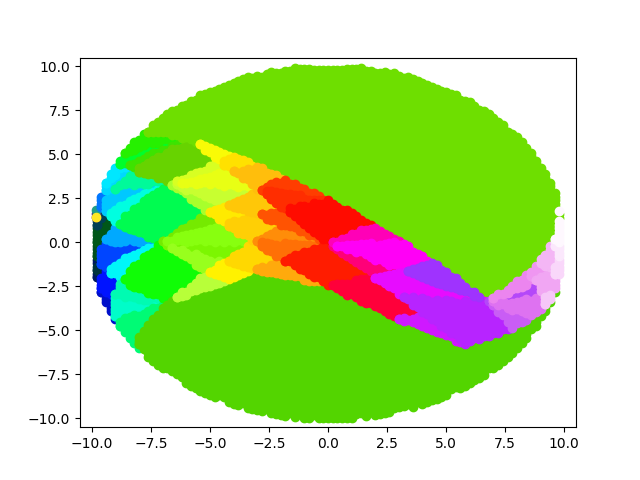

This generates the following 75 behaviours (visualized as the final L_g for standard parameters)

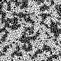"  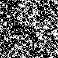"  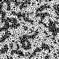"  "  "  "  "  "  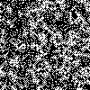"  "  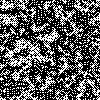"  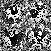"  "  "  "  "  "  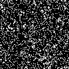"  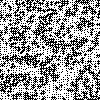"  "  "  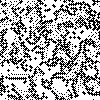"  "  "  "  "  "  "  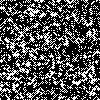"  "  "  "  "  "  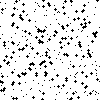"  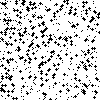"  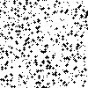"  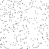"  "  "  "  "  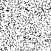"  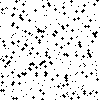"  "  "  "  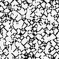"  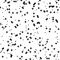"  "  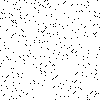"  "  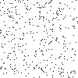"  "  "  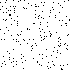"  "  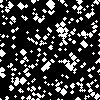"  "  "  "  "  "  "  "  "  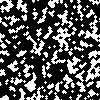"  "  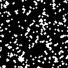"  "  "  "  

Below is the associated gifs used to generate them. The 'stability' of each behaviour can be seen by their gifs.

"  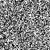"  "  "  "  "  "  "  "  "  "  "  "  "  "  "  "  "  "  "  "  "  "  "  "  "  "  "  "  "  "  "  "  "  "  "  "  "  "  "  "  "  "  "  "  "  "  "  "  "  "  "  "  "  "  "  "  "  "  "  "  "  "  "  "  "  "  "  "  "  "  "  

**1200 point standard phase portrait**

This generates the following 75 behaviours (visualized as the final L_g for standard parameters)

"  "  "  "  "  "  "  "  "  "  "  "  "  "  "  "  "  "  "  "  "  "  "  "  "  "  "  "  "  "  "  "  "  "  "  "  "  "  "  "  "  "  "  "  "  "  "  "  "  "  "  "  "  "  "  "  "  "  "  "  "  "  "  "  "  "  "  "  "  "

Below is the associated gifs used to generate them. The 'stability' of each behaviour can be seen by their gifs.

"  "  "  "  "  "  "  "  "  "  "  "  "  "  "  "  "  "  "  "  "  "  "  "  "  "  "  "  "  "  "  "  "  "  "  "  "  "  "  "  "  "  "  "  "  "  "  "  "  "  "  "  "  "  "  "  "  "  "  "  "  "  "  "  "  "  "  "  "  "

**de Brujin conditioned (1 update) phase portrait**

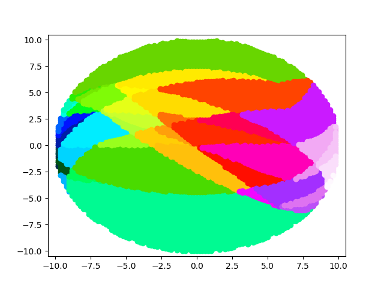

This generates the following 45 behaviours (visualized as the final L_g for standard parameters)

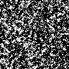"  "  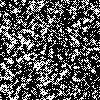"  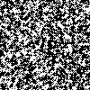"  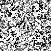"  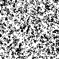"  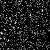"  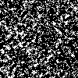"  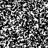"  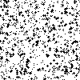"  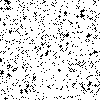"  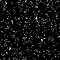"  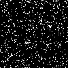"  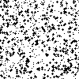"  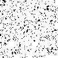"  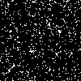"  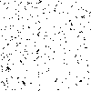"  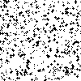"  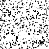"  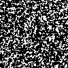"  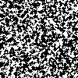"  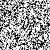"  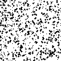"  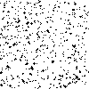"  "  "  "  "  "  "  "  "  "  "  "  "  "  "  "  "  "  "  "  "  "  

Below is the associated gifs used to generate them. The 'stability' of each behaviour can be seen by their gifs.

"  "  "  "  "  "  "  "  "  "  "  "  "  "  "  "  "  "  "  "  "  "  "  "  "  "  "  "  "  "  "  "  "  "  "  "  "  "  "  "  "  "  "  "  "  

**de Brujin conditioned (40 updates) phase portrait**

This generates the following 31 behaviours (visualized as the final L_g for standard parameters)

"  "  "  "  "  "  "  "  "  "  "  "  "  "  "  "  "  "  "  "  "  "  "  "  "  "  "  "  "  "  "  

Below is the associated gifs used to generate them. The 'stability' of each behaviour can be seen by their gifs.

"  "  "  "  "  "  "  "  "  "  "  "  "  "  "  "  "  "  "  "  "  "  "  "  "  "  "  "  "  "  "  

**(6x6) Torus size phase portrait**

This generates the following 27 behaviours (visualized as the final L_g for standard parameters)

"  "  "  "  "  "  "  "  "  "  "  "  "  "  "  "  "  "  "  "  "  "  "  "  "  "  "  

Below is the associated gifs used to generate them. The 'stability' of each behaviour can be seen by their gifs.

"  "  "  "  "  "  "  "  "  "  "  "  "  "  "  "  "  "  "  "  "  "  "  "  "  "  "  

**(46x46) Torus size phase portrait**

This generates the following 80 behaviours (visualized as the final L_g for standard parameters)

"  "  "  "  "  "  "  "  "  "  "  "  "  "  "  "  "  "  "  "  "  "  "  "  "  "  "  "  "  "  "  "  "  "  "  "  "  "  "  "  "  "  "  "  "  "  "  "  "  "  "  "  "  "  "  "  "  "  "  "  "  "  "  "  "  "  "  "  "  "  "  "  "  "  "  "  "  "  "  "  

Below is the associated gifs used to generate them. The 'stability' of each behaviour can be seen by their gifs.

"  "  "  "  "  "  "  "  "  "  "  "  "  "  "  "  "  "  "  "  "  "  "  "  "  "  "  "  "  "  "  "  "  "  "  "  "  "  "  "  "  "  "  "  "  "  "  "  "  "  "  "  "  "  "  "  "  "  "  "  "  "  "  "  "  "  "  "  "  "  "  "  "  "  "  "  "  "  "  "  

**10 Update phase portrait**

This generates the following 82 behaviours (visualized as the final L_g for standard parameters)

"  "  "  "  "  "  "  "  "  "  "  "  "  "  "  "  "  "  "  "  "  "  "  "  "  "  "  "  "  "  "  "  "  "  "  "  "  "  "  "  "  "  "  "  "  "  "  "  "  "  "  "  "  "  "  "  "  "  "  "  "  "  "  "  "  "  "  "  "  "  "  "  "  "  "  "  "  "  "  "  "  "  

Below is the associated gifs used to generate them. The 'stability' of each behaviour can be seen by their gifs.

"  "  "  "  "  "  "  "  "  "  "  "  "  "  "  "  "  "  "  "  "  "  "  "  "  "  "  "  "  "  "  "  "  "  "  "  "  "  "  "  "  "  "  "  "  "  "  "  "  "  "  "  "  "  "  "  "  "  "  "  "  "  "  "  "  "  "  "  "  "  "  "  "  "  "  "  "  "  "  "  "  "  

**40 Update phase portrait**

This generates the following 75 behaviours (visualized as the final L_g for standard parameters)

"  "  "  "  "  "  "  "  "  "  "  "  "  "  "  "  "  "  "  "  "  "  "  "  "  "  "  "  "  "  "  "  "  "  "  "  "  "  "  "  "  "  "  "  "  "  "  "  "  "  "  "  "  "  "  "  "  "  "  "  "  "  "  "  "  "  "  "  "  "  

Below is the associated gifs used to generate them. The 'stability' of each behaviour can be seen by their gifs.
     
"  "  "  "  "  "  "  "  "  "  "  "  "  "  "  "  "  "  "  "  "  "  "  "  "  "  "  "  "  "  "  "  "  "  "  "  "  "  "  "  "  "  "  "  "  "  "  "  "  "  "  "  "  "  "  "  "  "  "  "  "  "  "  "  "  "  "  "  "  "  

The following behaviours appear across all associated phase portraits (note they are animated for 20 updates below).
