# behaviourCollector
This git project contains a method to visually display all behaviours detected by a phase portrait of a 2 state FBCA. The code used to generate phase portraits can be accessed at https://github.com/mkreitze/mastersThesis.

The following is each phase portrait with associated found behaviours.

**8000 point standard phase portrait**
# for some reason I need to use the htlm method for this shit
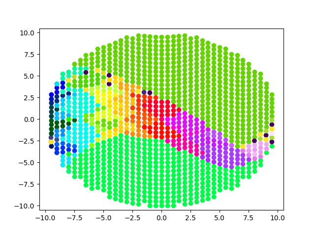

This generates the following 75 behaviours (visualized as the final L_g for standard parameters)

"
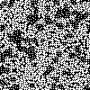"
"
"
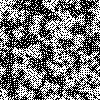"
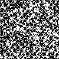"
"
"
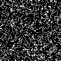"
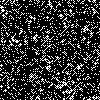"
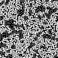"
"
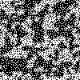"
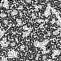"
"
"
"
"
"
"
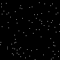"
"
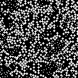"
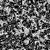"
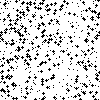"
"
"
"
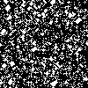"
"
"
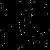"
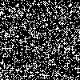"
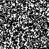"
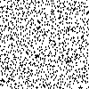"
"
"
"
"
"
"
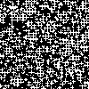"
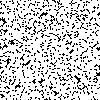"
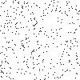"
"
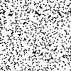"
"
"
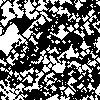"
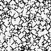"
"
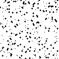"
"
"
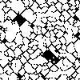"
"
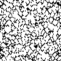"
"
"
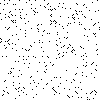"
"
"
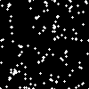"
"
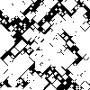"
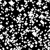"
"
"
"
"
"
"
"
"
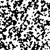"

Below is the associated gifs used to generate them. The 'stability' of each behaviour can be seen by their gifs.

"
"
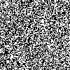"
"
"
"
"
"
"
"
"
"
"
"
"
"
"
"
"
"
"
"
"
"
"
"
"
"
"
"
"
"
"
"
"
"
"
"
"
"
"
"
"
"
"
"
"
"
"
"
"
"
"
"
"
"
"
"
"
"
"
"
"
"
"
"
"
"
"
"
"
"
"
"
"
